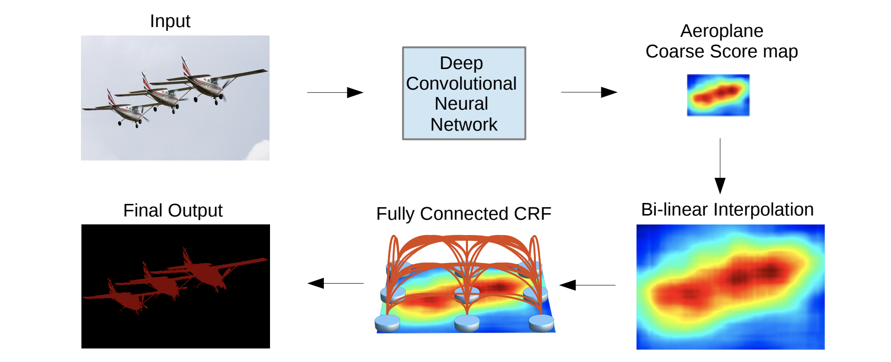

# DeepLab v1 Implementation with Pytorch

## 0. Develop Environment

## 1. Explain about Implementation

## 2. Brief Summary of *'Semantic Image Segmentation with Deep Convolutional Nets and Fully Connected CRFs'*

### 2.1. Goal
- Improve performance of semantic segmentation

### 2.2. Intuition
- Atrous algorithm : prevent signal downsampling than original VGG-16
- Fully connected pairwise CRF : preserve fine edge details

### 2.3. Evaluation Metric
- Mean intersection over union

### 2.4. Network Architecture

- DCNN : modified VGG-16
  * change fully connected layers to convolution layers
  * skip subsampling in 2 max-pooling layers
  * atrous algorithm in last 3 convolution layers (2x)
  * atrous algorithm in fist fully connected layer (4x) and change kernel size to 3*3
  * change channel size of fully connected layers (4096 -> 1024)
  * change channel size of final fully connected layer (1000 -> 21)
- Fully connected pairwise CRF : followed the paper of [Efficient Inference in Fully Connected CRFs with Gaussian Edge Potentials](https://arxiv.org/pdf/1210.5644.pdf)

### 2.5. Train and Inference on PASCAL VOC 2012
#### 2.5.1. Train
- 2-stage training
  * learn DCNN first
  * learn CRF next
- Augmentation : use extra data
- Objective : sum of cross-entropy terms for each spatial position in the CNN output map
- Train Details
  * minibatch SGD with momentum
    * batch size : 20
    * learning rate : 0.001 (0.01 for final classifier layer)
    * momentum : 0.9
    * weight decay : 0.0005

#### 2.5.2. Inference
- Upsampling : bilinear upsampling CNN output to get input shape (h, w)

## 3. Reference Paper
- Semantic Image Segmentation with Deep Convolutional Nets and Fully Connected CRFs [[paper]](https://arxiv.org/pdf/1412.7062.pdf)
